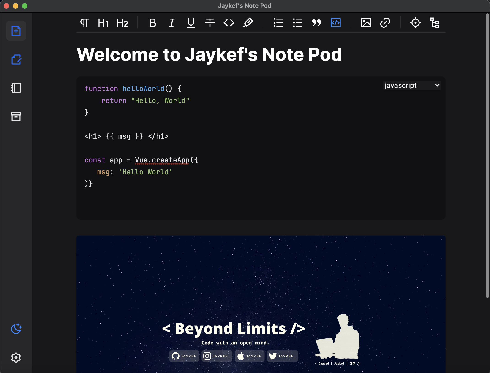
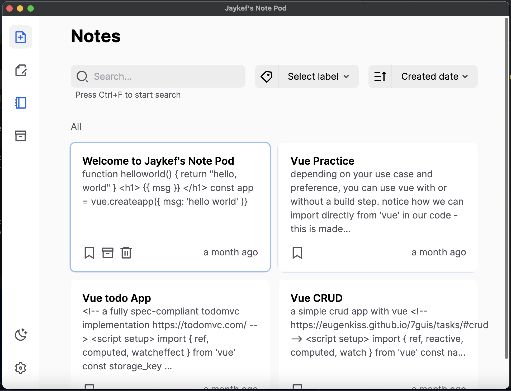
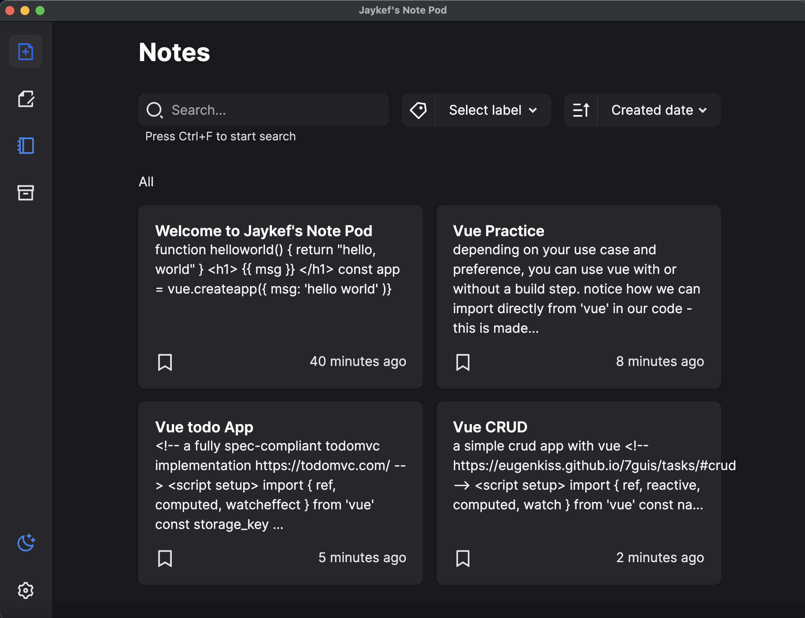
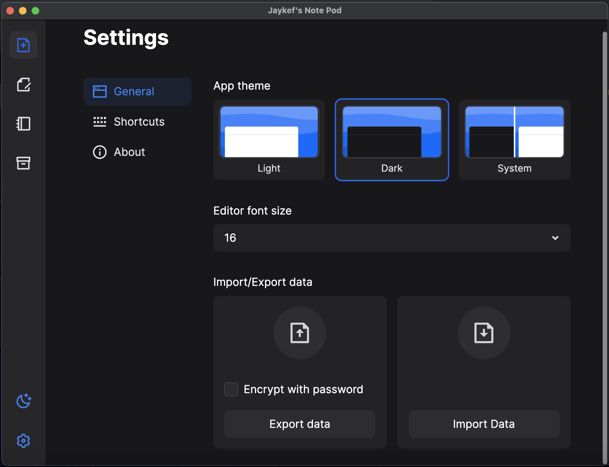

# Jaykef's Notes Pod
a simple note-taking app built with vue.
Inspired by NoteThing.

## Features
- Markdown formatting
- Command prompt
- Linked note
- Labels
- Export/Import data
- Headings tree
- Focus mode
- Dark theme

## Project setup
```
yarn install
```

### Compiles and hot-reloads for development
```
yarn watch
```

### Compiles and minifies for production
```
yarn build
```

### Lints and fixes files
```
yarn lint
```
